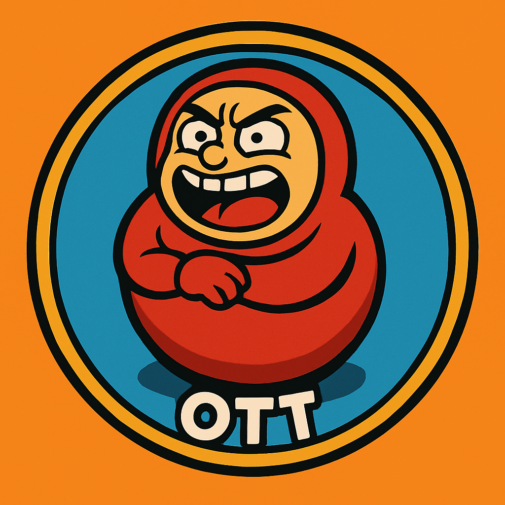
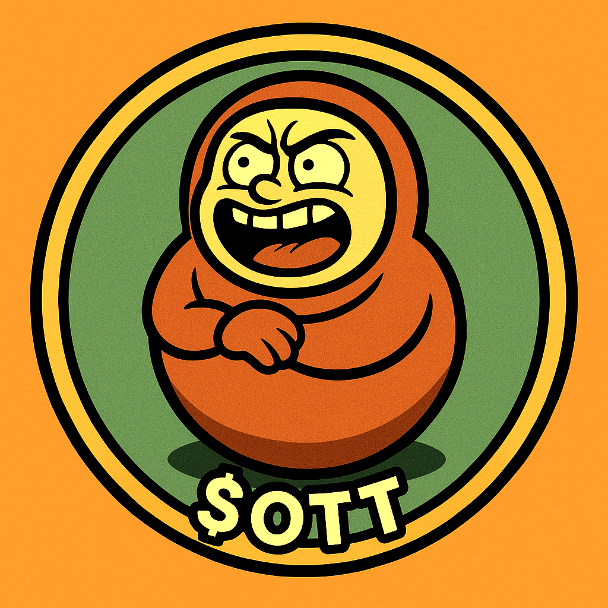
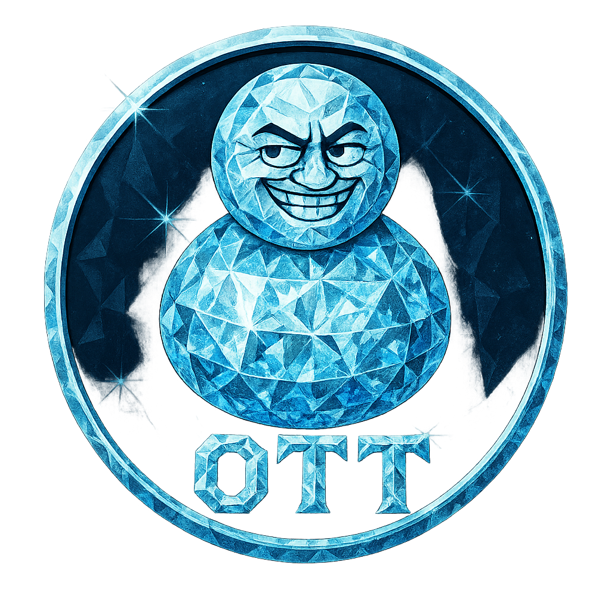
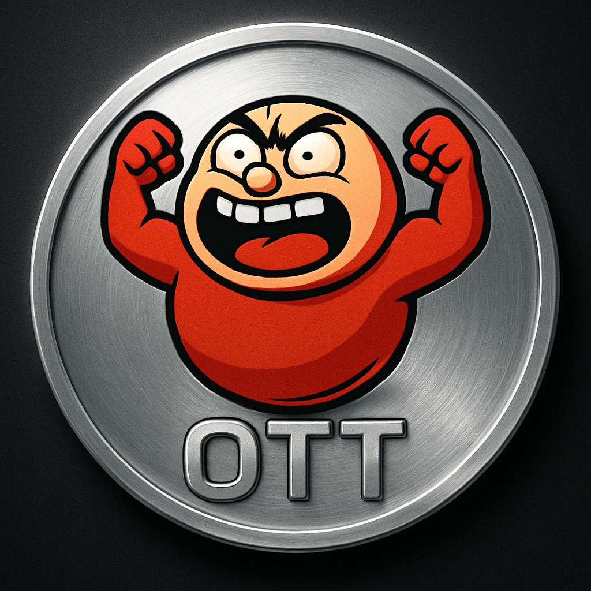

<p align="center">
  
</p>

<h1 align="center">$OTT — 넘어져도 다시 일어나는 코인 🎎</h1>

<p align="center">
  <em>"Fall Seven Times, Stand Up Eight." — 七転八起</em>
</p>

<p align="center">
  <a href="https://solana.com"></a>
  <a href="docs/OTT_Whitepaper_v2.pdf"></a>
  
  
</p>

---

## 🎎 What is $OTT?

**$OTT (오뚜기)** is an emotional utility memecoin on Solana. 

오뚜기 means "tumbling doll" — a figure that always stands back up no matter how many times it falls. Just like crypto holders who endure dips and come back stronger.

**Hold $OTT → Receive Cheer NFTs automatically in your wallet.**

When the market crashes and your portfolio bleeds red, a warm message arrives in your wallet: *"It's okay to fall. Just stand back up. 🎎"*

---

## ✨ Key Features

| Feature | Description |
|---------|-------------|
| 🪙 **Fair Launch** | Pump.fun — No presale, no premine |
| 🎨 **Cheer NFT Airdrop** | Hold tokens → Receive encouragement NFTs |
| 📦 **Compressed NFT** | 1,000x cheaper than regular NFTs |
| 🎯 **5 NFT Grades** | Common → Rare → Epic → Legendary → Mythic |
| 🌍 **4 Languages** | Korean, English, Japanese, Chinese |
| 🔒 **LP Burned** | Liquidity permanently locked |

---

## 📊 Tokenomics

| Item | Detail |
|------|--------|
| **Ticker** | $OTT |
| **Chain** | Solana (SPL Token-2022) |
| **Total Supply** | 2,430,000,000,000 (2.43T) |
| **Distribution** | LP 85% · Airdrop 5% · Team 5% · Marketing 3% · Reserve 2% |
| **Team Lock** | 6-month lockup |
| **LP** | Burned (permanently locked) |

> **Supply Meaning:** 8.1B (world population) × 100 (100% support) × 3 ("Life gives 3 chances") = 2.43T — 300 chances for every person on Earth.

---

## 🎨 NFT Grades

<table>
<tr>
<td align="center"><strong>⚪ Common</strong><br>Short words<br>"희망", "Fighting!"</td>
<td align="center"><strong>🔵 Rare</strong><br>One-liner<br>"Don't give up!"</td>
<td align="center"><strong>🟣 Epic</strong><br>2-3 sentences<br>Decorated card</td>
<td align="center"><strong>🟡 Legendary</strong><br>40 limited<br>AI Art + Quote</td>
<td align="center"><strong>🔴 Mythic</strong><br>3 limited<br>Ultimate Art</td>
</tr>
</table>

### Mythic NFTs — Only 3 Exist

<p align="center">
  
  
  
</p>

<p align="center">
  🥇 <strong>Gold</strong> — Embossed Coin &nbsp;&nbsp;
  💎 <strong>Diamond</strong> — Crystal Texture &nbsp;&nbsp;
  🪙 <strong>Platinum</strong> — Victory Pose
</p>

---

## 🌱 Holder Tiers

| Tier | Holding | Airdrop Frequency | Grade Bonus |
|------|---------|-------------------|-------------|
| 🌱 Seed | 10K ~ 99K | Weekly | ×1.0 |
| 🌿 Sprout | 100K ~ 999K | 2x/week | ×1.5 |
| 🌳 Tree | 1M ~ 99M | 3x/week | ×2.5 |
| 🏔 Mountain | 100M ~ 9.9B | 5x/week | ×4.0 |
| 🌍 Earth | 10B+ | Daily | ×6.0 |

---

## 💬 Message Database

**1,793 cheer messages** across 4 languages and 5 categories.

```
⚪ Common (1,040): 희망 · 화이팅 · Hope · 勇気
🔵 Rare (500): "포기하지 마, 오뚜기처럼!"
🟣 Epic (200): "넘어져도 괜찮아, 다시 일어나면 돼. 넌 그럴 수 있는 사람이야!"
🟡 Legendary (50): "넘어지는 것은 실패가 아니다. 넘어진 채 일어나지 않는 것이 실패다."
🔴 Mythic (3): Ultimate messages with artwork
```

---

## 🗺️ Roadmap

| Phase | Timeline | Milestones |
|-------|----------|------------|
| **1. Genesis** | Week 1-2 | Token launch, Website, Telegram, X |
| **2. Cheers Begin** | Week 3-6 | cNFT system, Auto-airdrop bot, NFT gallery |
| **3. Growth** | Month 2-4 | 1K+ holders, KOL marketing, Marketplace |
| **4. Expansion** | Month 4+ | Multi-chain, Merch, Mobile app, DAO |

---

## 📁 Repository Structure

```
ott-coin/
├── docs/
│   ├── WHITEPAPER.md          # 백서 (한국어)
│   ├── WHITEPAPER_EN.md       # Whitepaper (English)
│   ├── TECHNICAL_SPEC.md      # Technical Specification
│   └── OTT_Whitepaper_v2.pdf  # PDF Version
├── assets/
│   ├── logos/                 # Main logos
│   └── nft/                   # Mythic NFT artwork
│       ├── gold/
│       ├── diamond/
│       └── platinum/
├── data/
│   └── messages/              # Cheer message database
│       ├── cheer_messages.db  # SQLite DB (1,793 messages)
│       ├── add_message.py     # Add messages
│       └── stats.py           # DB statistics
└── scripts/                   # Utility scripts
```

---

## 📄 Documents

- 📖 [Whitepaper (한국어)](docs/WHITEPAPER.md)
- 📖 [Whitepaper (English)](docs/WHITEPAPER_EN.md)  
- 📄 [Whitepaper PDF](docs/OTT_Whitepaper_v2.pdf)
- 🔧 [Technical Specification](docs/TECHNICAL_SPEC.md)

---

## ⚠️ Disclaimer

**$OTT is a memecoin. This is NOT investment advice.**

- You may lose your entire investment
- No guarantee of price, liquidity, or returns
- DYOR (Do Your Own Research)
- Only invest what you can afford to lose

See the [full disclaimer](docs/WHITEPAPER.md#-면책-조항-disclaimer) in the whitepaper.

---

<p align="center">
  <strong>$OTT — 오뚜기처럼, 다시. 🎎</strong><br>
  <em>Fall Seven Times, Stand Up Eight.</em>
</p>

---

*© 2026 OTT Project. All rights reserved.*
